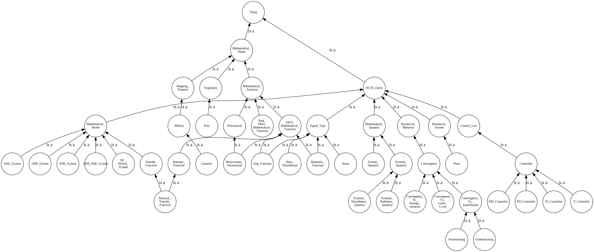

  
**Important notice:** This repo holds an old and meanwhile deprecated version of the Ontology of Control Systems Engineering (OCSE). Currently, (2022-09-27) a new version (*OCSE 0.2*) is developed as part of the ACKREP project: <https://github.com/ackrep-org/erk-data-control-theory>.

            
# Ontology of Control Systems Engineering

This repo contains some attempts to formalize knowledge from the field of control systems engineering.

Current status (2021-02-18):

- initial attempt of taxonomy
    - obviously incomplete
    - i.e. only concept hierarchy, no roles, no individuals

